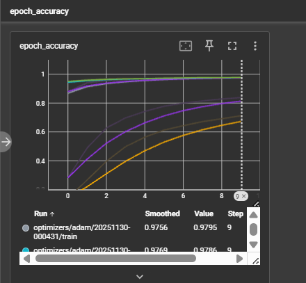
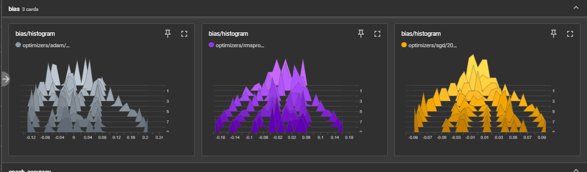
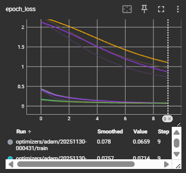
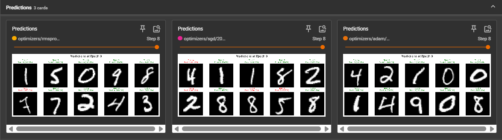

# TensorBoard Lab - Optimizer Comparison on MNIST

## Project Overview
This lab is based on the TensoBoard lab, here I compared three different optimizers (SGD, Adam, RMSprop) on MNIST digit classification using TensorBoard for visualization and analysis.

## What's Different from Other Labs
- **Dataset**: MNIST digits (different from Fashion-MNIST in other labs)
- **Focus**: Optimizer comparison
- **Architecture**: Simple Dense network for fast training

## TensorBoard Results
- Attached are the tensorboard results in the assets folder.

## TensorBoard Results

### Accuracy Comparison

### Accuracy vs Iterations

### Bias Analysis

### Loss Comparison

### Loss Ratio

### Model Predictions
